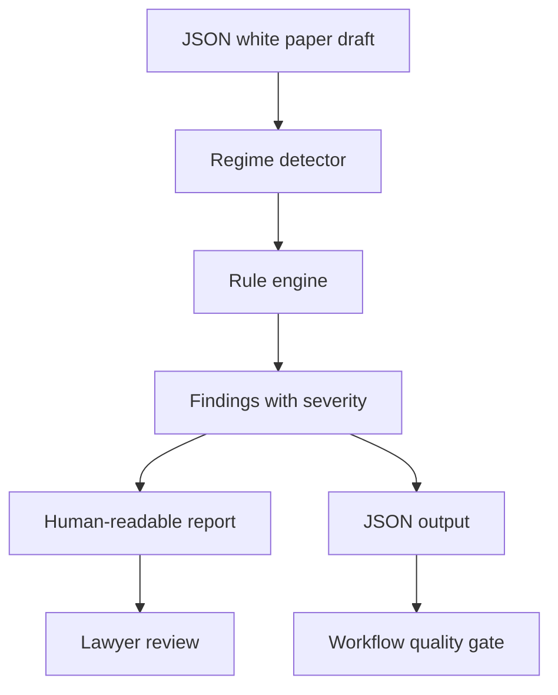

# MiCAR Whitepaper Linter

Deterministic first-pass linter for MiCAR crypto-asset white paper drafts. Reads a JSON draft, applies the rule set keyed to the white paper regime, and emits a structured report with citations, severity levels and JSON output.

This is not legal advice. It is a screening tool that a practising lawyer supervises.

## What this proves

* Dense EU financial regulation can be translated into structured, testable software rules.
* Legal automation is strongest when it produces cited findings, review states and machine-readable output.
* MiCAR review can be improved without pretending that a checklist replaces legal judgment.

## Problem

Crypto-asset white paper review involves repeated structural checks across different regulatory regimes. Drafting reviews often catch the same categories of gaps repeatedly: missing required disclosures, thin sections, incomplete issuer information, unclear redemption language, incomplete reserve information and insufficient risk warnings.

Doing that read-through manually on every draft is wasteful and inconsistent across reviewers.

## What I built

A Python package that:

- detects the white paper regime from the draft itself,
- applies the relevant rule set,
- ranks findings by severity,
- emits either a human-readable report or machine-readable JSON for downstream pipelines.

## Architecture



Each rule carries a stable `rule_id`, a citation, the section key it reads and a severity. The rule sets are the contribution of a practising lawyer; the engine is generic.

## Status

Alpha. The core scaffolds are in place and cover the disclosure architecture end-to-end. More granular rules, language support and reviewer audit features are roadmap items.

## Stack

Python 3.11+, zero core runtime dependencies, hatchling build, pytest, ruff, GitHub Actions CI. Optional extras `[docx]` and `[pdf]` unlock DOCX and PDF white paper ingestion.

## How to run

```bash
git clone https://github.com/sebastianforste/micar-whitepaper-linter.git
cd micar-whitepaper-linter
python3 -m micar_linter examples/art-stablecoin.json
python3 -m micar_linter examples/incomplete.json --strict
```

No install needed for the JSON workflow: the core package has zero runtime dependencies and runs straight from source via `python3 -m micar_linter`. To install as a CLI named `micar-lint`, run `pip install -e .` and you can drop the `python3 -m`. For PDF or DOCX ingestion run `pip install -e ".[all]"`.

JSON output for pipelines:

```bash
python3 -m micar_linter examples/emt-token.json --json
```

Strict mode returns exit code 1 if any blocker finding is open. Wire it into a pre-review quality gate.

## Sample output

`reports/sample-art-pass.txt` and `reports/sample-incomplete-blockers.txt` are committed so a reviewer sees the tool working without installing anything.

```text
[MISS  ] [BLOCKER] COMMON.RISK_WARNING  Mandatory risk warning statement
          Section: 'risk_warning'  (0 words)
          - Section is empty or absent.

[REVIEW] [BLOCKER] ANNEX_REVIEW  Reserve or safeguarding information
          Section: 'reserve_or_safeguarding'  (3 words)
          - Section is thin: 3 words, expected at least 150.
          - Missing review terms: composition, segregation, custodian, valuation, audit.
```

## Input format

A white paper draft is one JSON file with a top-level `type`, a `title`, and a `sections` object whose keys match the rule `section` identifiers. See `examples/` for one fixture per regime.

## Layout

```text
src/micar_linter/
  rules/
  linter.py
  report.py
  cli.py
examples/
reports/
tests/
```

## Launch readiness

For a reviewer-friendly runbook covering demo path, checks, sample-data rules, architecture and safety posture, see [`docs/launch-readiness.md`](docs/launch-readiness.md).

## Roadmap

See open issues. Headline items: more granular rule coverage, German-language draft support, public supervisory source enrichment and a reviewer audit log.

## License

MIT. The legal classifications encoded in this repository reflect the author's reading of MiCAR and are not legal advice. A practising lawyer must supervise every white paper review.